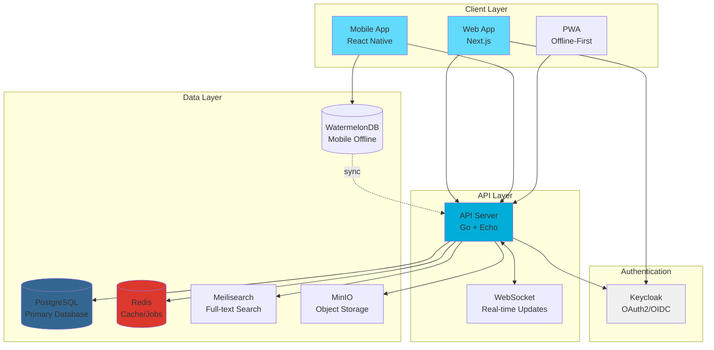
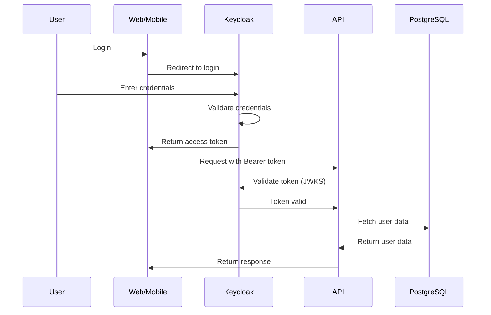

# PhysioFlow

[](LICENSE)
[](package.json)
[](apps/api/go.mod)
[](package.json)

> A modern, ground-up Physical Therapy EHR system designed for Vietnamese healthcare settings

PhysioFlow is a next-generation Electronic Health Records system purpose-built for physical therapy clinics. It addresses critical UX issues in legacy EHR systems by providing checklist-driven visit workflows, native bilingual support (Vietnamese/English), offline-first architecture, and mobile-optimized clinical documentation.

## Key Features

### Checklist-Driven Visit Workflow
- **The visit IS the checklist** - Instead of navigating forms, therapists complete a smart checklist and documentation auto-generates
- **1-3 clicks to common actions** (vs 5-7+ in traditional EHRs)
- **~5 min/patient documentation** (vs ~15 min traditional)
- **Auto-generated SOAP notes** from checklist completion
- **One-tap quick actions**: "+3 days" scheduling, "Copy previous treatment", instant progress tracking

### Native Bilingual Support
- **Vietnamese-first design** with seamless English fallback
- Intelligent language toggling without layout disruption
- Localized clinical terminology and workflows
- Context-aware translation assistance

### Offline-First Architecture
- Full functionality without internet connection
- Mobile PWA for bedside documentation
- Automatic conflict resolution on sync
- Queue-based background sync with Redis

### Clinical Workflow Optimization
- **15-minute onboarding** (vs 2 weeks traditional)
- **< 5 minute walk-in to treatment** workflow
- Self-service patient check-in via QR/kiosk
- Zero-friction handoffs between staff roles
- Real-time updates via WebSocket

## Tech Stack

### Frontend
- **Next.js 14** - React framework with App Router
- **TypeScript** - Type-safe development
- **shadcn/ui** - Accessible component library (Radix UI + Tailwind CSS)
- **Zustand** - State management
- **React Query** - Server state management
- **next-intl** - Internationalization

### Mobile
- **React Native** - Cross-platform mobile framework
- **Expo** - Development platform (SDK 50)
- **WatermelonDB** - Offline-first reactive database
- **Expo Router** - File-based navigation

### Backend
- **Go 1.22** - High-performance API server
- **Echo v4** - Web framework
- **PostgreSQL 16** - Primary database
- **Redis 7** - Caching and job queues

### Infrastructure
- **Docker Compose** - Local development
- **Keycloak** - OAuth2/OIDC authentication
- **MinIO** - S3-compatible object storage
- **Meilisearch** - Fast search engine
- **Kubernetes** - Production deployment (planned)

## Prerequisites

Before you begin, ensure you have the following installed:

- **Node.js** 20.0.0 or higher ([Download](https://nodejs.org/))
- **Go** 1.22 or higher ([Download](https://go.dev/dl/))
- **pnpm** 9.15.0 or higher (`npm install -g pnpm`)
- **Docker Desktop** ([Download](https://www.docker.com/products/docker-desktop/))
- **Git** ([Download](https://git-scm.com/downloads))

## Quick Start

### 1. Clone and Install

```bash
# Clone the repository
git clone https://github.com/tqvdang/physioflow.git
cd physioflow

# Install dependencies (uses pnpm workspaces)
pnpm install
```

### 2. Start Infrastructure Services

```bash
# Navigate to Docker infrastructure
cd infrastructure/docker

# Copy environment configuration
cp .env.example .env

# Initialize and start all services (PostgreSQL, Redis, Keycloak, MinIO, Meilisearch)
make init

# Verify all services are running
make status
```

This will start:
- **PostgreSQL** on `localhost:7012` (physioflow & keycloak databases)
- **Redis** on `localhost:7013`
- **Keycloak** at `http://localhost:7014` (admin/admin_secret_dev_only)
- **MinIO** at `http://localhost:7015` (console: `http://localhost:7016`)
- **Meilisearch** at `http://localhost:7017`

### 3. Configure Applications

```bash
# Web application
cd apps/web
cp .env.example .env.local

# Mobile application
cd apps/mobile
cp .env.example .env
```

### 4. Start Development Servers

```bash
# From project root - starts all apps concurrently
pnpm dev
```

This starts:
- **Web app** at `http://localhost:7010`
- **API server** at `http://localhost:7011`
- **Mobile app** via Expo (follow terminal instructions)

## Project Structure

```
emr/
├── apps/
│   ├── web/                    # Next.js frontend application
│   │   ├── src/
│   │   │   ├── app/           # Next.js 14 App Router
│   │   │   │   ├── [locale]/  # Internationalized routes
│   │   │   │   └── auth/      # Authentication pages
│   │   │   ├── components/    # React components
│   │   │   ├── lib/           # Utilities and helpers
│   │   │   └── styles/        # Global styles
│   │   └── package.json
│   │
│   ├── api/                    # Go backend API
│   │   ├── cmd/api/           # Application entry point
│   │   ├── internal/
│   │   │   ├── config/        # Configuration management
│   │   │   ├── handler/       # HTTP request handlers
│   │   │   ├── middleware/    # HTTP middleware
│   │   │   ├── model/         # Domain models
│   │   │   ├── repository/    # Data access layer
│   │   │   └── service/       # Business logic
│   │   ├── pkg/               # Reusable packages
│   │   └── go.mod
│   │
│   └── mobile/                 # React Native mobile app
│       ├── app/               # Expo Router screens
│       │   ├── auth/          # Authentication flow
│       │   ├── tabs/          # Tab navigation
│       │   └── patient/       # Patient session screens
│       ├── components/        # React Native components
│       └── lib/               # Mobile utilities
│
├── packages/
│   ├── shared-types/          # TypeScript type definitions
│   │   └── src/               # Shared types between apps
│   ├── shared-utils/          # Common utilities
│   │   └── src/               # Date formatting, validators, etc.
│   └── ui/                    # Shared UI components (planned)
│
├── infrastructure/
│   ├── docker/                # Docker development environment
│   │   ├── docker-compose.yml         # Core services
│   │   ├── docker-compose.dev.yml     # Development tools
│   │   ├── Makefile                   # Service management commands
│   │   ├── init-scripts/              # Database initialization
│   │   └── keycloak/                  # Keycloak realm configuration
│   │
│   ├── db/                    # Database management
│   │   ├── migrations/        # SQL migration files
│   │   ├── seeds/             # Seed data scripts
│   │   └── schema.sql         # Database schema
│   │
│   └── k8s/                   # Kubernetes manifests (planned)
│
├── docs/                      # Documentation
│   ├── DESIGN.md              # Product design & architecture
│   ├── TECH_STACK.md          # Technical specifications
│   └── README.md              # Documentation overview
│
├── package.json               # Root package configuration
├── pnpm-workspace.yaml        # pnpm monorepo configuration
├── turbo.json                 # Turborepo build configuration
└── README.md                  # This file
```

## Development

### Running Locally

```bash
# Start all development servers (from root)
pnpm dev

# Run specific app
pnpm --filter @physioflow/web dev
pnpm --filter @physioflow/mobile dev

# Start API server (from apps/api)
cd apps/api
go run cmd/api/main.go
```

### Environment Variables

#### Web Application (`apps/web/.env.local`)
```bash
NEXT_PUBLIC_API_URL=http://localhost:7011/api
NEXT_PUBLIC_APP_NAME=PhysioFlow
NEXT_PUBLIC_APP_URL=http://localhost:7010

# Keycloak Authentication
NEXT_PUBLIC_KEYCLOAK_URL=http://localhost:7014
NEXT_PUBLIC_KEYCLOAK_REALM=physioflow
NEXT_PUBLIC_KEYCLOAK_CLIENT_ID=physioflow-web
```

#### Mobile Application (`apps/mobile/.env`)
```bash
EXPO_PUBLIC_API_URL=http://localhost:7011/api/v1
```

#### Docker Services (`infrastructure/docker/.env`)
See `infrastructure/docker/.env.example` for complete configuration options.

### Running Tests

```bash
# Run all tests
pnpm test

# Run tests for specific app
pnpm --filter @physioflow/web test

# Go API tests
cd apps/api
go test ./...
```

### Code Quality

```bash
# Type checking
pnpm typecheck

# Linting
pnpm lint

# Code formatting
pnpm format

# Format check (CI)
pnpm format:check
```

### Database Management

```bash
# Access PostgreSQL CLI (physioflow database)
cd infrastructure/docker
make psql

# Access Keycloak database
make psql-keycloak

# Run migrations (from infrastructure/db)
psql -U emr -d physioflow -f migrations/001_initial_schema.sql

# Seed data
psql -U emr -d physioflow -f seeds/development_data.sql
```

### Docker Service Management

```bash
cd infrastructure/docker

# Start all services
make up

# Start with development tools (Adminer, MailHog, Redis Commander)
make up-dev

# Stop services
make down

# View logs
make logs
make logs-follow

# Check service health
make health

# Reset all data (WARNING: destructive)
make reset

# Access Redis CLI
make redis-cli
```

## Architecture

### System Overview



### API Overview

The API follows a clean architecture pattern with distinct layers:

**Base URL**: `http://localhost:7011/api/v1`

#### Core Endpoints

```
Authentication
  POST   /auth/login              - User login
  POST   /auth/refresh            - Refresh access token
  POST   /auth/logout             - User logout

Patients
  GET    /patients                - List patients
  POST   /patients                - Create patient
  GET    /patients/:id            - Get patient details
  PUT    /patients/:id            - Update patient
  DELETE /patients/:id            - Delete patient

Sessions (Visits)
  GET    /sessions                - List sessions
  POST   /sessions                - Create session
  GET    /sessions/:id            - Get session details
  PUT    /sessions/:id            - Update session
  POST   /sessions/:id/complete   - Complete session

Checklists (Core Feature)
  GET    /checklists/templates    - List checklist templates
  GET    /sessions/:id/checklist  - Get session checklist
  PUT    /sessions/:id/checklist  - Update checklist items
  POST   /sessions/:id/generate-notes - Generate SOAP notes

Quick Actions
  POST   /sessions/:id/actions/schedule-next    - Schedule next visit
  POST   /sessions/:id/actions/copy-treatment   - Copy previous treatment
  POST   /sessions/:id/actions/progress-photo   - Add progress photo
```

See `docs/DESIGN.md` for complete API documentation.

### Authentication Flow



### Offline Sync Strategy

PhysioFlow uses a queue-based sync architecture:

1. **Local-first operations**: All actions work offline via WatermelonDB (mobile) or IndexedDB (web PWA)
2. **Change tracking**: Every modification creates a sync event in local queue
3. **Background sync**: Redis-backed job queue processes sync events when online
4. **Conflict resolution**: Last-write-wins with manual resolution UI for conflicts
5. **Optimistic updates**: UI updates immediately, syncs in background

```
User Action → Local DB Update → UI Update (instant)
                    ↓
              Sync Queue Entry
                    ↓
              [When Online]
                    ↓
         Background Sync Worker
                    ↓
              API Reconciliation
```

## Key Features Explained

### Checklist-Driven Visits

Traditional EHR workflow:
```
Form → Form → Form → Type notes → Save → Schedule
5-7 clicks, 15 minutes per patient
```

PhysioFlow workflow:
```
Start Session → Tap checklist items → Done
1-3 clicks, ~5 minutes per patient (note auto-generated)
```

**How it works:**
1. Therapist starts a patient session
2. Smart checklist appears based on patient condition and treatment plan
3. As items are checked off, structured data is collected
4. SOAP notes auto-generate from checklist completion
5. One-tap quick actions for common tasks ("+3 days", "Copy previous")

### Bilingual Support

- **Seamless language toggle**: Switch between Vietnamese/English without layout shift
- **Context-aware**: Language preference persists per user, not per session
- **Clinical terminology**: Localized medical terms, not just UI translation
- **Input intelligence**: Type in either language, system understands both

### Quick Actions

Common clinic workflows optimized to 1-2 clicks:

- **Schedule next visit**: "+3 days", "+1 week", "Custom date"
- **Copy previous treatment**: Duplicate last session's interventions
- **Progress tracking**: One-tap photo capture with auto-tagging
- **Generate note**: AI-assisted SOAP note from checklist
- **Patient handoff**: Transfer to another therapist with context

## Vietnamese PT Features

PhysioFlow includes comprehensive Vietnamese healthcare integrations:

### BHYT Insurance
- **18 prefix codes** across 8 beneficiary categories (HC, DN, TE, CB, XK, NN, TN, TX)
- Automatic card validation with format checking
- Real-time coverage calculation (80-100% insurance, 0-20% copay)
- Integration with billing for automatic copay calculation

### Outcome Measures
- **8 standardized measures**: VAS, NDI, ODI, LEFS, DASH, QuickDASH, PSFS, FIM
- MCID (Minimal Clinically Important Difference) tracking
- Progress trending with baseline comparison
- Visual charts for patient education

### Billing System
- **8 PT service codes** with bilingual names (Vietnamese + English)
- VND currency handling with proper formatting
- BHYT integration for insurance coverage
- Multiple payment methods (cash, card, bank transfer, MoMo, ZaloPay, VNPay)

### Clinical Protocols
- **5 evidence-based protocols**: Lower Back Pain, Shoulder Pain, Knee OA, Post-Stroke, Pediatric
- Bilingual goals and exercise instructions
- Phase-based progression tracking
- Automatic outcome measurement scheduling

### Discharge Planning
- Baseline vs discharge comparison
- Home Exercise Program (HEP) export
- Bilingual discharge summaries (PDF generation)
- Follow-up instructions and referrals

### Medical Terminology
- **56 Vietnamese medical terms** across 5 categories
- Trigram-based autocomplete search
- ICD-10 code mapping
- Bilingual definitions and synonyms

**Documentation**: See [Vietnamese PT Features](docs/features/README.md) for complete documentation.

## Test Users

Keycloak is pre-configured with test users for development:

| Username | Password | Role | Email |
|----------|----------|------|-------|
| `admin` | `Admin@123` | super_admin | admin@physioflow.local |
| `clinic_admin` | `ClinicAdmin@123` | clinic_admin | clinic.admin@physioflow.local |
| `therapist1` | `Therapist@123` | therapist | therapist1@physioflow.local |
| `assistant1` | `Assistant@123` | assistant | assistant1@physioflow.local |
| `frontdesk1` | `FrontDesk@123` | front_desk | frontdesk1@physioflow.local |
| `patient1` | `Patient@123` | patient | patient1@physioflow.local |

**Keycloak Admin Console**:
- URL: `http://localhost:7014`
- Username: `admin`
- Password: `admin_secret_dev_only`
- Realm: `physioflow`

### Role Permissions

- **super_admin**: Full system access, multi-clinic management
- **clinic_admin**: Full clinic management, staff oversight, reports
- **therapist**: Patient treatment, documentation, scheduling
- **assistant**: Limited treatment access, support therapists
- **front_desk**: Patient intake, scheduling, check-in/out
- **patient**: View own records, appointments, exercises

## Contributing

### Development Workflow

1. **Create a feature branch**
   ```bash
   git checkout -b feature/your-feature-name
   ```

2. **Make changes and test**
   ```bash
   pnpm dev
   pnpm test
   pnpm lint
   ```

3. **Commit with conventional commits**
   ```bash
   git commit -m "feat(web): add checklist item drag-and-drop"
   git commit -m "fix(api): resolve session sync conflict"
   git commit -m "docs: update API documentation"
   ```

4. **Push and create pull request**
   ```bash
   git push origin feature/your-feature-name
   ```

### Code Style

- **TypeScript**: Follow ESLint configuration
- **Go**: Use `gofmt` and `golangci-lint`
- **Commits**: Use [Conventional Commits](https://www.conventionalcommits.org/)
- **Components**: Use shadcn/ui patterns for consistency

### Pull Request Process

1. Ensure all tests pass (`pnpm test`)
2. Update documentation if needed
3. Add changelog entry for user-facing changes
4. Request review from at least one maintainer
5. Squash commits before merging

## Documentation

Comprehensive documentation is available in the `docs/` directory:

### Core Documentation
- **[docs/DESIGN.md](docs/DESIGN.md)**: Complete product design, wireframes, user flows, database schema, API design, implementation roadmap
- **[docs/TECH_STACK.md](docs/TECH_STACK.md)**: Technical specifications, framework comparisons, component mappings, infrastructure specs
- **[docs/README.md](docs/README.md)**: Documentation overview and quick links

### Vietnamese PT Features
- **[docs/features/](docs/features/)**: Vietnamese healthcare features documentation
  - [BHYT Insurance](docs/features/BHYT_INSURANCE.md) - Insurance card validation and coverage calculation
  - [Outcome Measures](docs/features/OUTCOME_MEASURES.md) - 8 standardized PT assessment tools
  - [Billing](docs/features/BILLING.md) - VND billing with BHYT integration
  - [Clinical Protocols](docs/features/CLINICAL_PROTOCOLS.md) - Evidence-based treatment protocols
  - [Discharge Planning](docs/features/DISCHARGE_PLANNING.md) - Bilingual discharge summaries
  - [Medical Terminology](docs/features/MEDICAL_TERMINOLOGY.md) - Vietnamese medical terms dictionary

### API & Deployment
- **[docs/api/](docs/api/)**: API endpoint documentation
- **[docs/deployment/](docs/deployment/)**: Database migrations and performance benchmarks
- **[docs/user-guides/](docs/user-guides/)**: End-user documentation (Vietnamese + English)
- **[docs/admin-guides/](docs/admin-guides/)**: Administrator configuration guides

## Roadmap

### Current Phase: MVP Development (Months 1-3)
- Core authentication and authorization
- Patient management CRUD
- Basic session/visit workflow
- Checklist system foundation
- Mobile app scaffolding

### Phase 2: Clinical Workflows (Months 4-6)
- Advanced checklist templates
- SOAP note auto-generation
- Quick actions implementation
- Real-time updates (WebSocket)
- Offline sync for mobile

### Phase 3: Polish & Optimization (Months 7-9)
- Performance optimization
- Advanced reporting
- Multi-clinic support
- Patient portal
- Production deployment

### Future Enhancements
- AI-assisted documentation
- Telehealth integration
- Outcome tracking analytics
- Integration with medical devices
- Billing and insurance

## License

This project is licensed under the MIT License - see the [LICENSE](LICENSE) file for details.

## Acknowledgments

- Built with [shadcn/ui](https://ui.shadcn.com/) - Accessible component library
- Inspired by modern healthcare systems like [Tiro.Health](https://tiro.health/)
- Design principles from [UX of LEGO Interface Panels](https://www.designedbycave.co.uk/2020/LEGO-Interface-UX/)

## Support

For questions, issues, or feature requests:
- Open an issue on GitHub
- Email: tqvdang@msn.com (development)
- Documentation: `docs/` directory

---

**Version**: 0.0.1
**Last Updated**: January 2026
**Status**: Active Development
